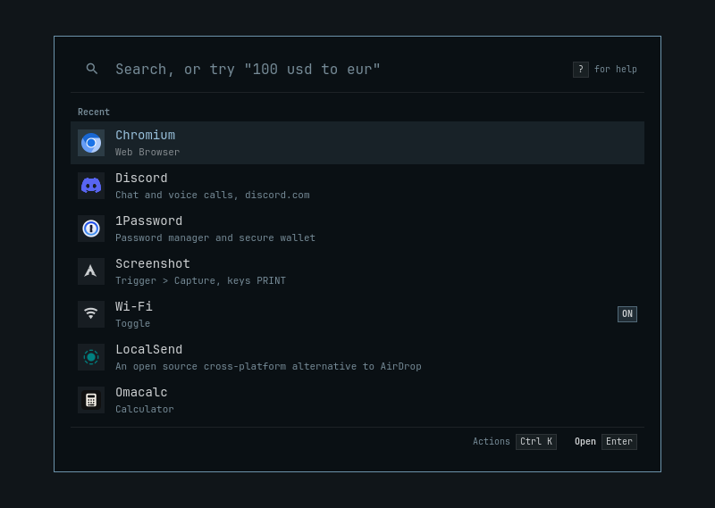
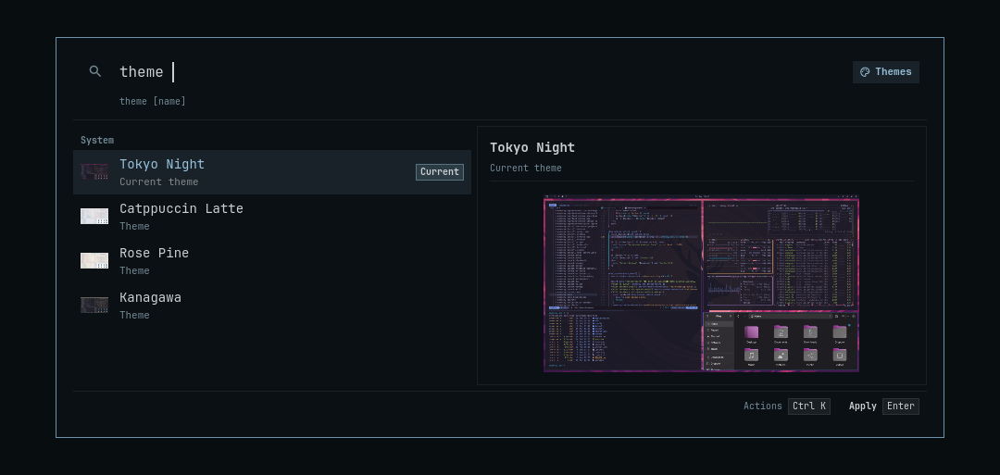
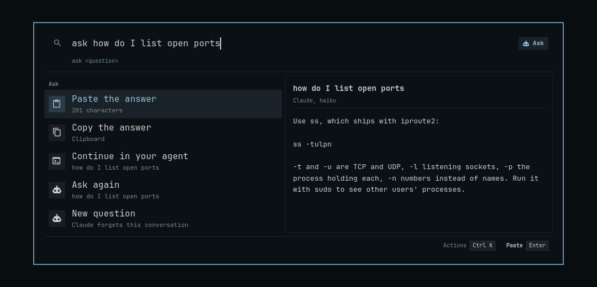
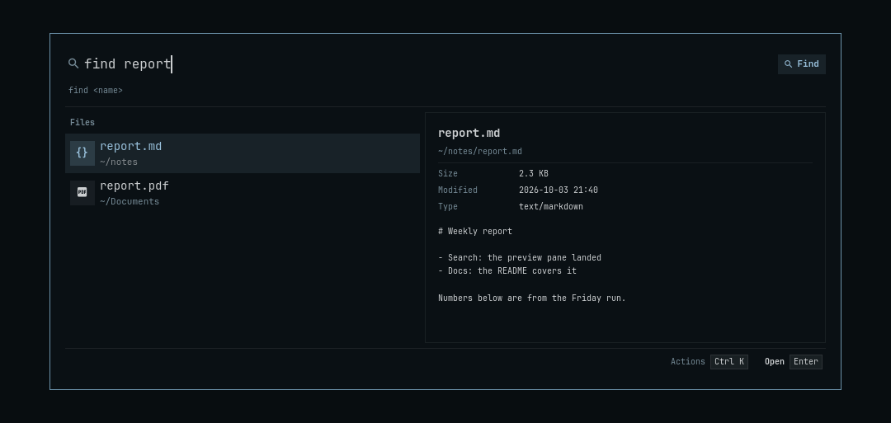
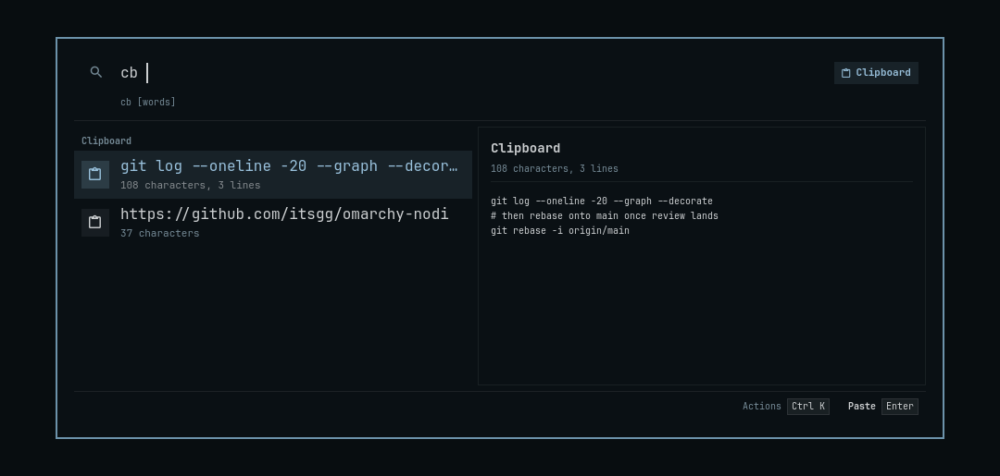

# Nodi

A command bar for Omarchy: press a key, type, press Enter. It opens apps and
windows, runs anything in Omarchy's menu, answers sums and conversions,
and finds emoji, clipboard entries, files and more.

Nodi (நொடி, said NO-dee) is Tamil for an instant: the time a snap of the
fingers takes, which is how long it should take to find anything.



<table>
<tr>
<td></td>
<td></td>
</tr>
<tr>
<td></td>
<td></td>
</tr>
</table>

## Install

```sh
omarchy plugin add https://github.com/itsgg/omarchy-nodi --enable
```

Super+Period opens it; set `"hotkey"` in
`~/.config/omarchy/extensions/nodi.json` for another key. A key something
else holds is left alone, and a notification says so. To open it with
text already typed:
`omarchy-shell shell toggle io.github.itsgg.nodi '{"query": ":"}'`.

## Use

| Type | For |
|---|---|
| `chromium`, `lsd`, `chromium new window` | An app, by name or its letters, or one of its actions |
| `w `, `w chromium` | An open window, or the ones of an app |
| `screenshot`, `dns`, `restart shell`, `install zed` | Anything in Omarchy's menu, your own entries included |
| `gaps`, `dnd`, `stay awake`, `wifi` | Toggles, with their state |
| `vol 60`, `bright off`, `remind 15 tea` | Volume, brightness and reminders |
| `theme tokyo`, `font jet`, `power profile` | Themes, fonts and power profiles |
| `version`, `omarchy ` | Omarchy's own commands |
| A plugin's name, `plugin` | Another plugin's panel, overlay or menu, opened as Omarchy's menu opens its own |
| `usage`, `agents` | Claude Code's and Codex's limits, each one's share and when it resets (the empty bar shows one at 80% or more); their sessions running in a terminal (in tmux too), with what you last asked, Enter going to the terminal |
| `window text`, `screenshot window`, `files`, `move 3` | The window you came from: its text, read and brought back here to act on; a screenshot of it alone; its folder in Files, when a shell runs in it; workspace 3 |
| `region text`, `pick a colour` | A capture whose result comes back to the bar: the text of a region, a colour's hex |
| `move 100 200`, `size 1280 720`, `next window` | A floating window's place and size, typed; the next window of the active app, round to the first (give it a hotkey) |
| `save desktop work`, `work`, `forget desktop work` | Which app is on which numbered workspace, saved by a name; opened again, each app with no window started on its workspace |
| `pause dropbox`, `tray` | An entry of a tray app's menu, chosen as a click in that menu |
| `full screen`, `keys ` | Keybindings, by what they do |
| `> htop` | A command, in a terminal |
| `12*8 + 15%`, `5 km to mi`, `100 usd to eur`, `3pm to tokyo` | Answers |
| `:fire`, `cb`, `f `, `notes.org`, `find report`, `~/Downloads/` | Emoji, clipboard, recent files (one by its whole name in any search), files, folders |
| `q4 report`, `find img cat`, `in budget` | Files by name in any search, three at most; one kind of file (img, doc, video, audio, dir); files that hold the words, in `~/Work` and `~/Documents` (`"files": { "contents": [...] }`) |
| `cb img`, `cb url`, `cb invoice` | One kind of entry; an image by the words in it. Ctrl+K pins an entry first, kept after the history drops it, or sends it to a device; "paste in sequence" pastes the newest text, then each older one on each press |
| `kill chromium`, `ports`, `services` | Processes, listening ports, user services |
| `h github`, `prs`, `tmux`, `ssh `, `man ls` | Browser history, pull requests, tmux, SSH hosts, man pages |
| `github.com/itsgg`, `localhost:3000`, `bm work` | Open a site as it is typed; your browser's bookmarks, three of them in any search |
| `uuid`, `b64 hello`, `epoch`, `#ff5722` | Small developer tools |
| `pkg zed`, `define serendipity` | Arch's packages and the AUR, installed in Omarchy's terminal; a word's senses from Wiktionary, English first and a few in the other languages it has |
| Open the bar over a Save or Open dialog; `downloads`, `~/Work/` | Folders first: the ones your recent files are in, zoxide's, your bookmarks; Enter types the path into the dialog, in front of the name it suggests, and the dialog's own Enter saves or opens there |
| `cal`, `cal standup`, `join` | Your calendar, once its iCal address is set (`"calendar": { "ics": ... }`): a meeting under way or within the hour first on the empty bar, Enter joining it (Meet, Zoom, Teams); the next eight days in order, each saying its day |
| `note call the bank`, `notes bank` | One dated line in `~/Documents/notes.md` (`"notes": { "file": ... }`); its lines found again, Enter opening the file (at the line, in a terminal editor) |
| `ask why is the sky blue`, or Tab | A quick answer from Claude, a conversation for ten minutes, or about the selected text or the window you came from; needs [Claude Code](https://claude.com/claude-code) installed and signed in |
| `ask lock my screen`, `ask turn on night light` | Claude finds the row and asks to run it: the bar shows it with its command, Enter runs it, Esc refuses |
| Select or copy text, then open the bar; `fix`, `rewrite `, `case ` | It fixed, rewritten, translated or its case changed, pasted over the selection or at the cursor; or searched |
| `tr ta good morning`, `good morning in french` | A translation by Claude; Enter pastes it |
| `?`, `?mine` | Help, with every example answered live; every alias, hotkey, favourite and hidden row you set |

Enter runs the selected row, Ctrl+K shows its other actions (an alias, a
favourite, a hotkey, hide), grouped, each with its key on the right, and
what is typed there finds one (Ctrl+Enter copies there too);
Ctrl+Shift+F, A, D and H favourite, alias, copy the deeplink of and hide
a row without it, and Ctrl+Shift+P pins a clipboard entry. Ctrl+1 to
Ctrl+9 run a row directly, Tab fills in, Esc closes, or first steps back
from Ctrl+K, a prompt or a help topic. With the mouse, a click runs a row,
a right click opens its actions, and each key in the footer clicks.
Closed within two minutes, the bar reopens on what was typed, selected;
later, on its home view. Ctrl+R brings back an earlier query, older on each
press, and Ctrl+W, Ctrl+E, Ctrl+F and Ctrl+B edit as a shell does. A row you pick for a query comes first for
it after a pick or two, and sooner for the start of it: picked as
"spotify", Spotify comes first at "s". Logging out, rebooting, clearing a history and
quitting a process you did not name ask for a second Enter. Opened empty, Nodi shows your favourites, what you run most
and your reminders.

## Configure

`nodi.json` (type `nodi settings` to open it) overrides
[`config.default.json`](config.default.json) and applies when saved. A file
that does not parse changes nothing, and a notification says why.

```jsonc
{
  "hotkey": "SUPER + SPACE",
  "currency": { "home": "INR", "favorites": ["USD", "EUR"] },
  "time": { "home": "Asia/Kolkata", "zones": ["UTC", "America/New_York"] },
  // Merged with the default keywords; "disabled": true removes one.
  "keywords": [
    { "keyword": "g", "title": "Search DuckDuckGo", "open": "https://duckduckgo.com/?q={q}", "suggest": true },
    { "keyword": "say", "title": "Notify", "run": "notify-send \"$1\"" },
    { "keyword": "map", "title": "Directions",
      "open": "https://www.google.com/maps/dir/{argument name=\"from\"}/{argument name=\"to\"}" }
  ],
  "snippets": [
    { "keyword": "sig", "name": "Signature", "text": "Regards,\nGanesh" },
    { "keyword": "mt", "name": "Meeting", "text": "Meet {argument name=\"who\"} at {argument name=\"when\" default=\"3pm\"}" }
  ],
  // A few words from Claude for apps with no description of their own.
  "apps": { "describe": true },
  // Your calendar, by its secret iCal address (Google Calendar: Settings,
  // the calendar, Integrate calendar); a list for more than one, and your
  // address, so an invitation you declined is left out.
  "calendar": { "ics": "https://calendar.google.com/calendar/ical/.../basic.ics", "me": "you@example.com" },
  // What `tr` and Translate on selected text go to (English unless set).
  "translate": { "language": "Tamil" },
  // Ask's model, and MCP servers its answers may use, each call on your Enter
  // (with Ask's actions on, as they are unless "actions": false).
  "ask": { "model": "sonnet", "mcpServers": { "github": { "command": "github-mcp-server", "args": ["stdio"] } } }
}
```

With that, `g omarchy` searches DuckDuckGo, with DuckDuckGo's
suggestions for what you type under it (`"suggest": true`, which the
built-in `g`, `yt` and `wiki` have; a keyword of yours by the same word
replaces the built-in one whole, so it says `"suggest": true` itself),
`say hello` posts a
notification, `map home office` gives directions, `sig` pastes a
signature and `mt Ravi 4pm` a filled-in sentence (Enter pastes it where
you were, Ctrl+Enter copies it). Placeholders, in `open` and in snippets:
`{q}` or `{argument name="..." default="..."}` for the words typed after
the keyword (the last one takes the rest), `{clipboard}`, `{date}`,
`{time}` (with `format="d MMM yyyy"` and `offset="+1d"`), `{uuid}`, an
older clipboard entry `{clipboard offset="1"}` and `{random from="a,b,c"}`
or `{random min="1" max="6"}`; in snippets also another snippet's text,
`{snippet name="sig"}` (its own placeholders filled too); in both, `{selection}`, the text selected in the
window you came from; and in snippets `{cursor}`, where the cursor is left after the
paste, by Left keys over the text after it. Those count places as
Chromium, Electron and GTK do; a Qt app joins no Indic conjunct, so after
"क्ष" there the cursor stops a place short. In
`run`, what you type is the command's `$1`, never written into its text, so
use it as a script would: `"$1"`, quoted, and kept out of arithmetic such
as `$((...))`, where bash evaluates what it holds. A `run` written with
`{q}` says to write `"$1"` instead, and runs nothing.

Script commands are executable files in `~/.config/omarchy/nodi/scripts`
with a header:

```bash
#!/bin/bash
# @nodi.title Greet
# @nodi.mode silent
# @nodi.argument1 { "type": "text", "placeholder": "name" }
echo "hello $1"
```

Saved as `greet`, `greet Ravi` runs it and shows its last line as a
notification. `fullOutput` runs it in a terminal instead, and `inline`
shows its output on its row; `needsConfirmation` asks for a second Enter
and `currentDirectoryPath` sets where it runs. `scripts.dirs` lists more
folders. The same header with `@raycast.` works, so
scripts from [raycast/script-commands](https://github.com/raycast/script-commands)
run as they are.

A script filter is a program that turns what you type after a keyword
into rows, as you type:

```jsonc
"filters": [
  { "keyword": "n", "title": "Notes", "icon": "󰎞", "command": ["my-notes", "--nodi"] }
]
```

`n meet` runs `my-notes --nodi meet`: the words after the keyword, trimmed,
are the last argument (so a program must not read it as an option) and
`NODI_QUERY`. From your session it gets PATH, HOME, USER,
`XDG_RUNTIME_DIR`, `OMARCHY_PATH`, the Wayland, Hyprland and D-Bus
variables, and nothing else; LANG is `C.UTF-8`. It is told of the window
you came from, the one that had the focus when the bar opened:
`NODI_WINDOW_ADDRESS` (Hyprland's, `0x...`), `NODI_WINDOW_CLASS`,
`NODI_WINDOW_TITLE`, `NODI_WINDOW_PID` and `NODI_WINDOW_WORKSPACE`, each
empty when not known. It runs for 3 s at most
(`timeoutMs`, up to 10000), and each keystroke ends the run before it, the
program and what it started. Where two take the same word, the one earlier
in `providers` wins: by default your `keywords`, snippets and script
commands, then filters, then answers (below), then Nodi's own prefixes
(`w`, `kill`, `cb`), so pick a word of its own. It prints one
JSON object a line, each a row; only `title` is required:

```json
{"title": "Meeting notes", "subtitle": "Monday", "icon": "󰎞", "image": "/abs/path.png", "badge": "3",
 "id": "notes/meeting", "action": {"exec": ["my-notes", "open", "meeting"]}, "confirm": true,
 "preview": "## Meeting notes\n\n- ship it", "actions": [{"title": "Copy link", "action": {"copy": "https://..."}}]}
```

`action` is one of `{"exec": [argv]}` (started through a login shell, its
arguments never read as shell), `{"open": "url or /path"}`,
`{"copy": "text"}`, `{"paste": "text"}` (into the window you were in) or
`{"query": "text"}` (fills the bar in). `confirm` asks before it runs:
`true` for a second Enter, or a word to type, such as `"send"` (up to 40
characters and no space; a longer word, or one with a space, is a second
Enter); any other value asks nothing. A row that asks
shows in the pane the exact command it runs, with `risk`, your words for
what it may cost, once Enter has armed it or its word is asked, and from
the start when it has no `preview`. It gets no hotkey or link, and
`nodi run` refuses it.
`preview` is Markdown for the pane beside the list, or `{"title",
"subtitle", "markdown"}`; pictures and HTML in it are shown as text, never
loaded. A row with an `id` is remembered and ranked like any other.
`actions` are what Ctrl+K offers, each with `exec`, `open`, `copy` or
`paste`, and `confirm`, `risk` and `undoable` as a row has them; one that
asks shows its command and risk while Ctrl+K is up. At most 50 rows (1,000 in a list, below); a
line that is not such an object is skipped. While a run is on its way, the
last rows stay. Fields are cut to a length: title 200 characters, subtitle
300, badge 24, icon 8, id 200, risk 500, preview 64 KB, and 12 actions.
Output past 1 MB is not cut: the run fails ("could not answer"). Left out
without a word: a filter whose keyword has a space or whose program holds
`=` or starts with `-`, an `exec` whose program starts with `-`, a copy or
paste of nothing, an image that is not an absolute path, and an `open`
that is neither a URL nor an absolute path.

A row may also carry `complete`, what Tab fills in (`"n meeting "`),
apart from its action, and `match`, more words it is found by. A filter
with `"list": true` runs its program once, with `NODI_QUERY` empty and no
argument, and keeps the rows for `"refresh"` (`"10m"` unless set, 10 s at
least; the last rows stay while it runs again); what you type after its
keyword then finds them, ranked and learned from as every row is, with no
run on each keystroke. With `"root": true` too, up to three of them come
up in any search from the second letter, among the rest, named cleanly
(by a word's start or the initials; a typo finds them under the keyword
only). `"rerun": "2s"` runs a filter that is no list again at that pace
while its rows show (half a second to a minute), for rows that change as
you watch; give such a row an `id`, or a change of its title makes it
another row, which loses a second Enter it waited for.

A row whose action is `{"next": "value"}` takes its filter a step on:
Enter runs the program again, once, with `NODI_PICK` the value,
`NODI_INFO` the row's `info` (never shown), `NODI_DATA` what the run
before printed as a line `{"data": "..."}`, `NODI_STEP` how many steps in,
and no query or argument; what you type then finds among its rows, and
Esc steps back. A step that prints no row has done its work, and the bar
closes. A step never runs twice by itself, since it may do what it says;
taken again, it runs again. `"format": "rofi"` runs a rofi script as rofi
does: first with no argument and `ROFI_RETV=0`, then, on Enter, with the
entry as its argument, `ROFI_RETV=1` (2 for what you typed, offered as a
row unless the script says `no-custom`), `ROFI_INFO` and `ROFI_DATA`. Its
entries' `icon`, `meta`, `info`, `display` and `nonselectable` are read,
and its `message` shows under the field.

A row or action with `"undoable": true` and an `exec` action is run by
Nodi itself, which reads what it prints. If its last line is
`{"undo": {"exec": ["my-notes", "restore", "meeting"], "title": "Restore the meeting note"}}`,
that command is offered as a row for ten minutes: first on the empty bar,
and found by its title or by `undo`; Enter twice runs it. Such an action
is a command that does its work and ends: it runs in the filter's
environment, not your session's whole one (no `DISPLAY`, `EDITOR` or
`GDK_SCALE`, for one), and is ended after two minutes, so it is no way to
open a window. If it fails, a notification says why, and no undo is
offered, whatever it printed. The undo itself runs as any action does, in
your session. The offer lasts while the shell runs, not across a restart.

An answer is a program that answers a question you type after a keyword,
on Enter rather than as you type, and what it prints shows as Markdown in
the pane as it arrives:

```jsonc
"answers": [
  { "keyword": "a", "title": "Assistant", "icon": "󰚩", "command": ["my-ask", "--markdown"] }
]
```

`a why is it slow`, then Enter, runs `my-ask --markdown "why is it slow"`
with the same environment, argument and `NODI_QUERY` as a script filter.
It runs for two minutes at most (`timeoutMs`, from 1000 to 600000) and may print
120 KB. What it prints shows a word at a time, at its spaces, so text
with no spaces (Chinese, a long URL) shows once it ends. Write each piece as you have it: a program whose output is
buffered when it goes into a pipe (Python's, for one) shows nothing until
it flushes. Escape while it answers stops it, the program and what it
started, and so does closing the bar. Once it has ended, Enter pastes the
answer where you were, Ctrl+Enter copies it, and Ask again asks it again;
if it fails, the last line it wrote to stderr says why.

Other settings: `fallbacks` (what a query nothing answers offers),
`ask.model` (the Claude model for `ask` and app descriptions, `haiku` by
default), `ask.actions` (`false` keeps Claude to answers, without the bar's
rows), and
`providers` (what Nodi searches, in order). A list you set replaces the default one, so start from
`config.default.json`; only `keywords` merge.

## From a terminal

`bin/nodi` in the plugin's folder is a command for scripts and
terminals; link it onto your PATH once:

```sh
ln -s ~/.config/omarchy/plugins/io.github.itsgg.nodi/bin/nodi ~/.local/bin/nodi
```

`nodi` opens the bar, `nodi cb` opens it with `cb` typed (`nodi -- run`
types a word the command itself would take), and `nodi run <key>` runs a
row by its key as its hotkey would; Ctrl+K's Copy deeplink shows a row's
key. Nodi knows a row by its key once it has been run or saved, which a
script filter's row can be only with an `id`. A row that asks before it
runs is refused there. `nodi pick` shows
the lines it reads from stdin as rows and prints the one you choose, as it
was read:

```sh
choice=$(printf '%s\n' Lock Suspend Reboot | nodi pick --placeholder Power)
```

With `--json`, each line is an object as a script filter prints one
(`title`, `subtitle`, `icon`, `image`, `badge`, `preview`); Enter only
chooses, so an `action` is not read. A pick takes 5000 rows and 8 MB at
most. Every form exits 0 when done, 1 when a pick ends without a choice,
2 when Nodi refuses (an unknown row, a row that asks first, rows it could
not read), its function fails or the command is misused, 3 when Nodi cannot be reached (a
pick whose bar goes away while it waits ends as 1), and 4 when a newer
pick took the bar before this one was answered.

### For agents

`nodi mcp` is the bar as an MCP server on stdin and stdout, for Claude
Code or any other agent. Its tools: `search` the bar's rows (each with a
key, what it runs, and whether it asks first), `run` one by its key
(refusing a row that asks, as `nodi run` does), `propose` one (the bar
opens on it with its command; your Enter runs it, Escape refuses), and
`approve`, a permission prompt tool for a headless `claude -p`: the bar
shows the tool and its input, and your Enter allows it. A key a search
found runs as found for ten minutes; one question waits in the bar at a
time, and a newer one takes its place, the older answered "not asked".
A query or a key is 64 KB at most.

```sh
claude mcp add nodi -- nodi mcp
claude -p "..." --permission-prompt-tool mcp__nodi__approve
```

## What it touches

- It starts programs the way Omarchy's menu does: through a login shell,
  with arguments that are never read as shell. A paste focuses the window
  the bar opened over first, then types into it.
- A command or script a row runs that fails and says why is reported in a
  notification, "<row> failed", with its last line of errors; a failure
  that says nothing, or a program closed, is not.
- `nodi mcp` runs only when an agent starts it, and runs a row only by
  `run`, which the agent's own permissions gate, or by your Enter.
- It sends what you type after `g`, `yt` or `wiki`, from the second letter,
  to DuckDuckGo's autocomplete (duckduckgo.com/ac) for suggestions; a
  keyword of yours does so only with `"suggest": true`.
- Under `pkg` it asks pacman and, through yay, the AUR; under `define`,
  Wiktionary (en.wiktionary.org's REST API) for the word typed.
- It goes online for exchange rates (open.er-api.com, once a day, or every
  ten minutes while that fails), for `prs` (through `gh`), and for Claude,
  through Claude Code's `claude` command, under `ask` and, if turned on, to describe
  apps. That Claude session has none of Claude Code's own tools, no MCP
  servers but the ones you name under `"ask": { "mcpServers": ... }` (in
  Claude Code's own format, each call shown in the bar for your Enter),
  and none of your Claude settings, and saves nothing; it keeps
  the conversation in memory for ten minutes after an answer. Its only
  tools are the bar's: a search of the rows, and a run of one, which
  shows in the bar with its command and runs only on your Enter. "Ask
  about this window" sends Claude a picture of the window you came from
  (`grim -T`, by its own buffer, so the bar is not in it), which stays in
  the conversation, and its cost in every question, until it starts afresh.
- Each time it opens it reads the text selected in the window you came
  from (`wl-paste --primary`) and the clipboard's text (never a password
  manager's), keeps them until it closes, and sends one to Claude only
  when you pick one of Claude's rows on it.
- It writes to `~/.cache/nodi/` and `~/.local/state/nodi/prefs.json`,
  which holds the text of each clipboard entry you pin, and the desktops
  you save (each app's desktop id, window class and workspace). A search under
  `cb` with words reads the text in each image of the history once, with
  Omarchy's `tesseract` (about 2 s an image, a few seconds at a time
  while that search is open), into `~/.cache/nodi/ocr/`; pasting in sequence
  keeps the history's texts in `$XDG_RUNTIME_DIR/nodi-sequence`, yours
  alone and gone at logout.
  Among the cache is how long its last 300 opens took (`opens.json`, read
  by `make opens`), with nothing of what was typed, and the last 1000 rows
  run from a query (`picks-log.json`, read by `make picks`): the queries
  typed, the row's key and its place, no titles. It binds its hotkey in the running Hyprland and edits no config file.
- At each open it reads the desktop's contrast and motion preferences
  (the portal's `org.freedesktop.appearance`, `gdbus`) and whether
  Hyprland animates (`hyprctl getoption animations:enabled`).
- It asks the shell for its plugins (`omarchy-shell shell listPlugins`)
  once an hour, when a search first needs them. While it is open it reads
  each tray app's menu and its submenus one level down, which asks the
  app to fill them in, as opening its menu in the tray does.
- It reads the usage records Omarchy's agents widget keeps
  (`~/.local/state/omarchy/agents/usage`) at each open, and under `agents`
  the process list, tmux's clients, and for a Claude Code session the
  record it keeps of the process (`~/.claude/sessions`) and the end of
  its own transcript in `~/.claude/projects`, for the last thing you
  asked it.
- Opened over a file dialog, it reads the folders of your recent files
  (`~/.local/share/recently-used.xbel`), zoxide's list, your GTK
  bookmarks and XDG folders; Enter on a folder types it into that dialog
  with `wtype`, only once that dialog has the focus again.
- With a calendar set, it fetches each iCal address when the bar opens,
  every ten minutes at most, keeping a copy in `~/.cache/nodi/calendar/`
  (yours alone), and works out its next nine days with Python's standard
  library (`lib/ics.py`); the address goes to that program in its
  environment, which only you can read, never in its arguments.
- From a search's third letter it looks for files of that name under
  your home with fd (`"files": { "root": false }` turns that off), and
  under `in` for files that hold the words with ripgrep.
- It uses what Omarchy ships. Wi-Fi state needs `nmcli`, browser history
  `sqlite3`, and pull requests a signed-in `gh`.

## Develop

```sh
make check     # tests, ranking, lint, compile, tests in Quickshell, the card under QtTest's mouse, renders (also at text size 20 on 1536x960), a screen reader's view, an input method composing, hygiene, manifest, validate
make rank      # how well it ranks, against tools/rank/baseline.json (make rank-update accepts a change)
make replay    # your own picks, replayed through today's ranking (from the log make picks reads)
make reload    # install, clear Quickshell's cache, restart the shell
make shots     # the card drawn offscreen, as PNGs in shots/
make bench     # how long a keystroke takes
```

A provider in `providers/` returns rows; `lib/Run.js` alone turns a row
into a command. [PLAN.md](PLAN.md) says why it is built this way.

## Credit

The calculator, units, currency, time, emoji, process, window and app
matching are ported from Saikomantisu's
[omarchy-commandbar](https://github.com/Saikomantisu/omarchy-commandbar)
(MIT), with their tests.

## License

MIT
